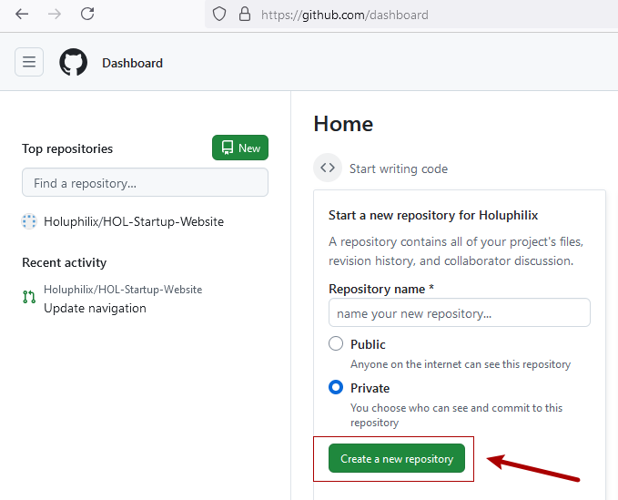
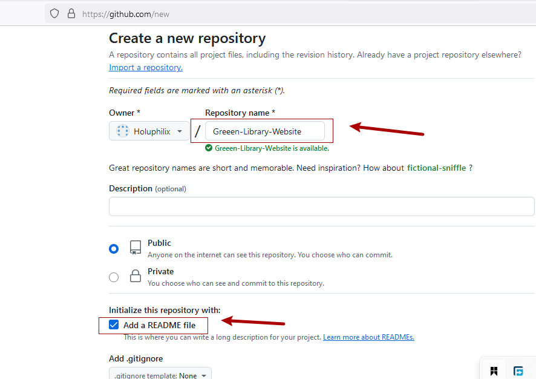
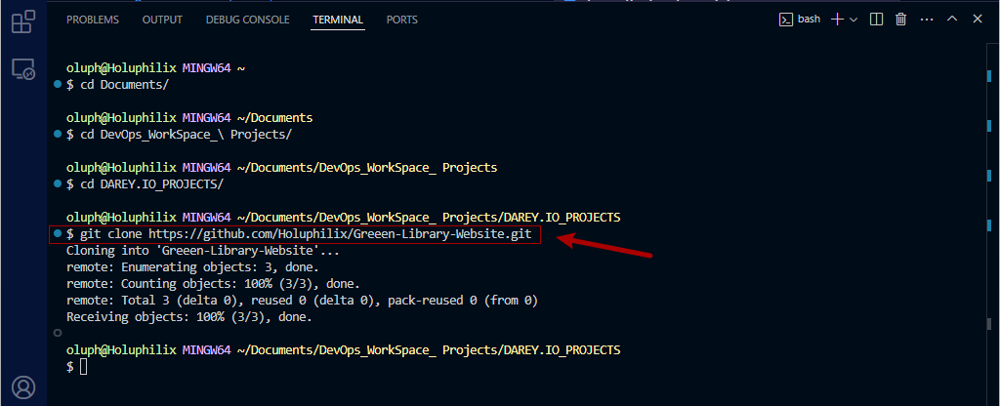
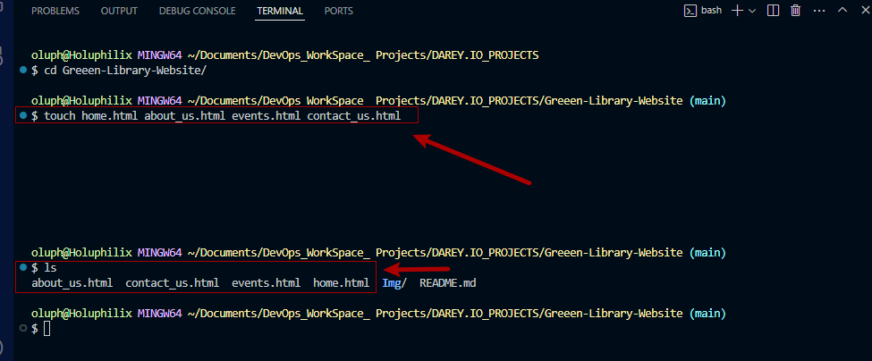
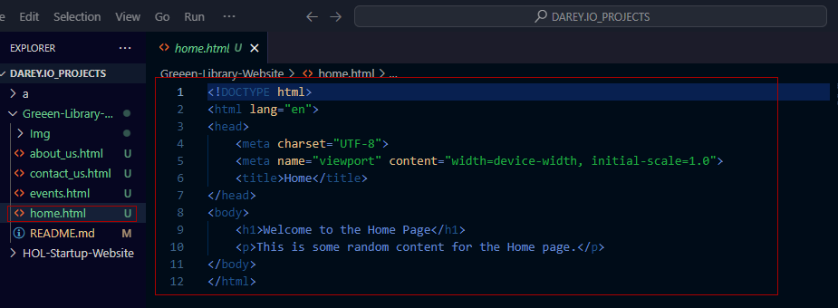
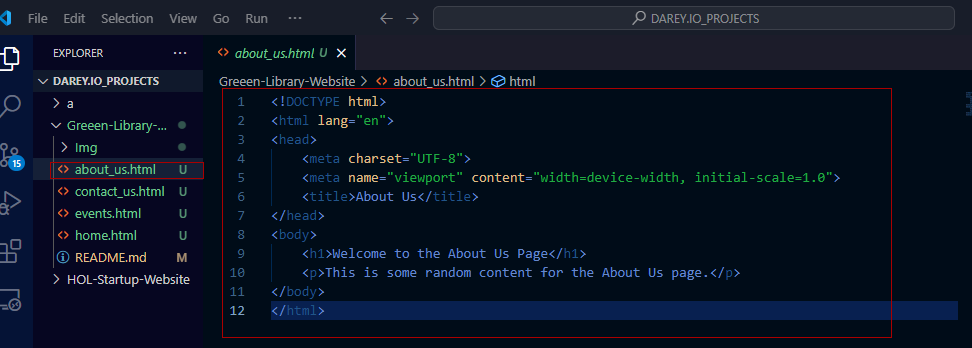
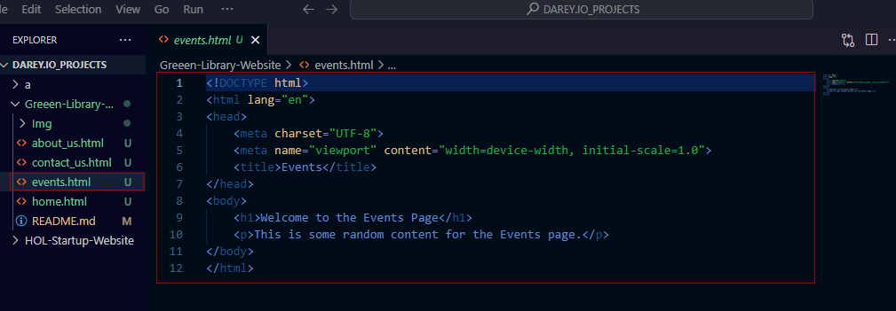
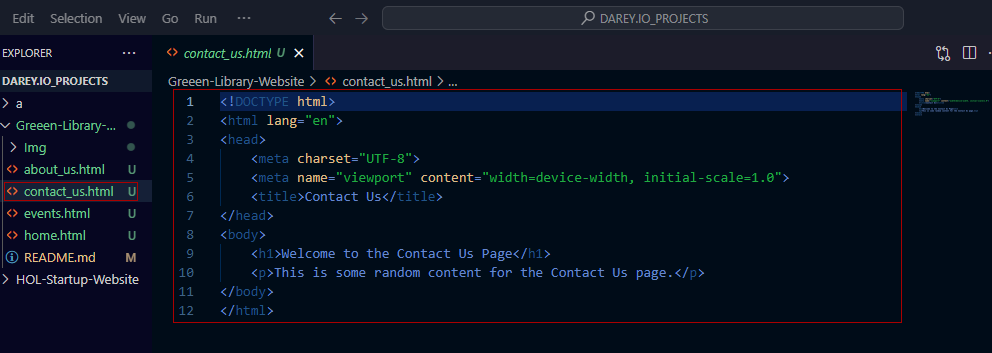

# Capstone Project: Enhancing a community Library Website

### Background Scenairo

You're part of a development team tasked with enchancing the website for the __Greenwood Community Library__. The website aims to be more engaging and informative for its visitors. It currently includes basic sections:__Home, About Us, Events, and Contact Us__. Your team decides to add a __"Book Reviews"__ section and update the __"Events"__ page to feature upcoming community events.  

You will simulate the roles of two contributors: __"Morgan"__ and __"Jamie"__. Morgan will focus on adding the __"Book Reviews"__ section, while jamie will update the __"Events"__ page with new community events.

### Objectives 
- Practice cloning a respository and working with branches in Git.

- Gain experince in staging, committing, and Pushing changes from both developers.
  
- Create pull request and merge them after resolving any potential conflicts.
  
  ### Setup
1. Create a Respository on GitHub:

  

- Name it __Greenwood-Library-Website__.
  
- Initiate it with a README.md file.

- Copy your Respository to your local machine.

- Clone it your local machine.
  
  

### Tasks

1. In the main branch, using Visual Studio Code editor ensure there are files for each of the web pages.

   - home.html
  
   - about_us.html
  
   - events.html

   - contact_us.html

  
2. Add any random content into each of the files.
  
  - Random content into the file of home.html 
  
  
  
  - Random content into the file of about_us.html
  
  
  
  - Random content into the file of events.html
  
  

  - Random content into the file of contact_us.html 
  
  

3. Stage, commit and push the changes directly to the __main__ branch. (This is a simulation of the team's existing code base for the website).

