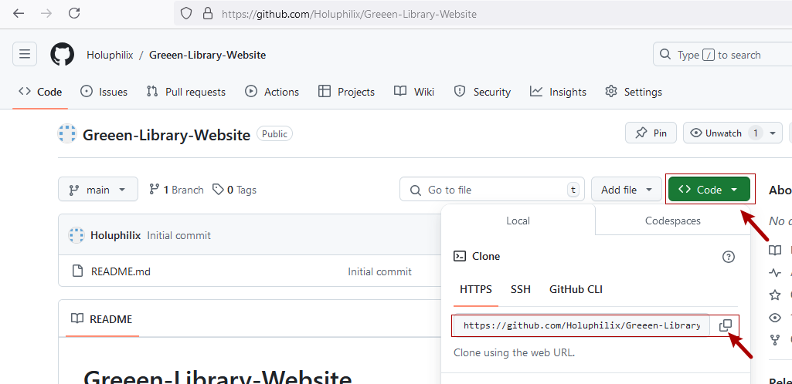
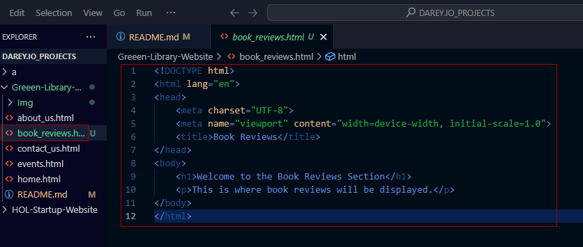

# Capstone Project: Enhancing a Community Library Website

### Background Scenario

You're part of a development team tasked with enhancing the website for the **Greenwood Community Library**. The website aims to be more engaging and informative for its visitors. It currently includes basic sections: **Home, About Us, Events, and Contact Us**. Your team decides to add a **"Book Reviews"** section and update the **"Events"** page to feature upcoming community events.

You will simulate the roles of two contributors: **"Morgan"** and **"Jamie"**. Morgan will focus on adding the **"Book Reviews"** section, while Jamie will update the **"Events"** page with new community events.

### Objectives

- Practice cloning a repository and working with branches in Git.
- Gain experience in staging, committing, and pushing changes from both developers.
- Create pull requests and merge them after resolving any potential conflicts.

### Setup

1. **Create a Repository on GitHub:**

   

   - Name it **Greenwood-Library-Website**.
   - Initiate it with a README.md file.

   

2. **Copy the Repository to your local machine:**

   

   - Clone it to your local machine:

     ```bash
     git clone https://github.com/yourusername/Greenwood-Library-Website.git
     ```

   

### Tasks

1. **In the `main` branch, using Visual Studio Code editor, ensure there are files for each of the web pages:**

   - `home.html`
   - `about_us.html`
   - `events.html`
   - `contact_us.html`

   

2. **Add any random content into each of the files:**
   - Random content into `home.html`

     

   - Random content into `about_us.html`

     

   - Random content into `events.html`

     

   - Random content into `contact_us.html`

     

3. **Stage, commit, and push the changes directly to the `main` branch** (This simulates the team's existing codebase for the website):

   ```bash
   git add .
   git commit -m "Initial commit: Add basic web pages"
   git push origin main
   ```

   

### Morgan's Work: Adding Book Reviews

1. **Create a branch for Morgan:**

   

   ```bash
   git checkout -b add-book-reviews
   ```

2. **Add a new file `book_reviews.html` to represent the Book Reviews section:**

   

3. **Add random text content into the file.**

   

4. **Stage, commit, and push changes:**

   ```bash
   git add book_reviews.html
   git commit -m "Add book reviews section"
   git push origin add-book-reviews
   ```

   

5. **Raise a PR for Morgan's work:**

   

6. **Merge Morgan's work to the `main` branch:**

   

### Jamie's Work: Updating the Events Page

1. **Create a branch for Jamie:**

   ```bash
   git checkout -b update-events
   ```

2. **Add a new file `update_events.html` to update the Events Page section:**

   

3. **Add random text content into the file.**

   

4. **Stage, commit, and push changes:**

   ```bash
   git add update_events.html
   git commit -m "Updating Event Page"
   git push origin update-events
   ```

   

5. **Raise a PR for Jamie's work:**

   

6. **Merge Jamie's work to the `main` branch:**

   


